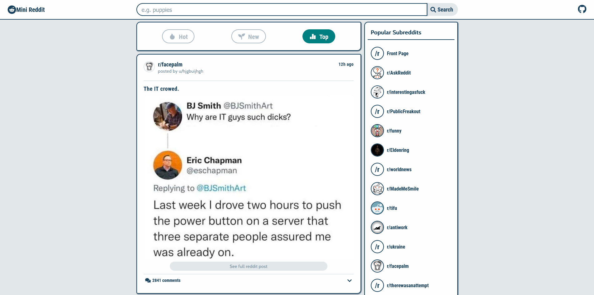

# Minimized Reddit

The goal of this project was to design and develop a minimized [Reddit](https://www.reddit.com) using Reddit's API with React & Redux.

**Link to project:** [https://jneff-mini-reddit.netlify.app/](https://jneff-mini-reddit.netlify.app/)

---

## How It's Made

This project makes use of the following technologies:

### Technologies

| *Technology*||
|---|---|
| **React** | For building user interface of the application |
| **Redux** | For application state management |
| **React-Markdown** | For converting api posts to proper format |
| **React Icons** | Provides popular icons |

---

### Features

| *Feature*||
|---|---|
| **Search** | Users are able to search for a specific term |
| **Filter** | Users are able to filter selected subreddit by trending values |
| **Select Subreddit**| Users are able to update post list be selecting from one of the popular subreddits listed aside, or by selecting the subreddit in the post's header |
| **Show NSFW/Spoilers** | Users are able to toggle the view nsfw and spoiler content.   Content is defaulted hidden |
| **Shorten Text Posts** | Users are able to toggle the body of any post with text to shorten the length displayed |
| **View Comments** | Users are able to view comments, but not make any |

---

## Run Locally

This project was bootstrapped with [Create React App](https://github.com/facebook/create-react-app), using the [Redux](https://redux.js.org/) and [Redux Toolkit](https://redux-toolkit.js.org/) template.
In the project directory, you can run:

### `npm start`

> Runs the app in the development mode.  
> Open [http://localhost:3000](http://localhost:3000) to view it in the browser.  
> The page will reload if you make edits.  
> You will also see any lint errors in the console.

### `npm test`

> Launches the test runner in the interactive watch mode.  
> See the section about [running tests](https://facebook.github.io/create-react-app/docs/running-tests) for more information.

### `npm run build`

> Builds the app for production to the `build` folder.  
> It correctly bundles React in production mode and optimizes the build for the best performance.  
